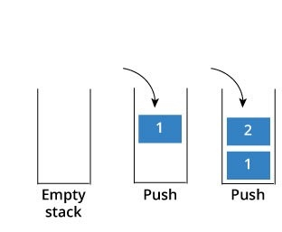
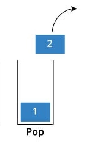

# Welcome to Stacks!!
What is a stack? I will answer that informally first and then give you a formal definition. Informally think of a spice on the grocery shelf. Imagine for a second you are the employee that has too restock the spices on a shelf. What do you do to the spices that are already there? Do you remove them or just push them to the back? You generally will push them to the back and the newer once are added to the front. The last one in is always the first one out. This in essence is a stack. 

The formal definition of a stack is items that are added last are removed first. This is also known as LIFO (Last in First out).

## **Adding to a Stack:**
Well you might be wondering how to add to a stack from the title. Relax young padawan we are getting there. To add to a stack in Python you have to push it on also known as the .append function. This will allow you to add to the stack and is done in O(1) performance time. This will be better represented in a table provided below. 

 

**Diagram:**



## **Removing from a Stack:**
To remove from a stack we have to do something called popping which is like deleting but just a different word. To do this in Python you need to do a very cool trick known as the .pop function. This will remove it from the data structure and you can even display all the values that have been removed. This operation happens in O(1) time.


**Diagram:**


## **Common Operations Table with BIG O:**


| Common Stack Operation  |  Description |  Python Code |  BIG O |  
|-------------------------|--------------|--------------|--------|
| push(value)             | Adds value to the stack  | stack.append(value)  | O(1)  |  |
| pop()  | Removes and returns value from the back of the stack.  | value = stack.pop()  | O(1)  |   |
| size()  | Return size of the stack  |  length = len(stack) | O(1)  |   |
| empty()  | Returns True if the length of the stack is zero  | if len(stack == 0)  |  O(1) |   |

## **Walkthrough Problem**
1. Download this practice problem and we will step through it together [stack_practice.py](stack_practice.py). 
2. Now that you have downloaded it you will notice that the push function and the pop functions are missing some code. Lets think about what we need to do to add to a stack. What should we do? There are two thing things that will work well. We can either add a value to the top of the stack using the function or we can use the .append method. Lets use the first one and then we will have more practice with append in the on your own problem. So we are going to try this snipit of code: 
    ``` python
    print(f'Inserting {val} into the stack')
            self.top = self.top + 1
            self.arr[self.top] = val
    ```
    what does this do? It adds to the stack without the .append method and uses the already built methods from our class.

3. Great job on the adding to a stack portion. Now we are going to work on removing from the stack. Again what do we know that can do this? If you said to use the .pop method then you would be right but for this problem we are going to build our own method of pop that shows us how this method works. Do you think that you can just do the opposite of the previous one? You would be mostly correct. 
    ``` python  
    print(f'We are removing {self.peek()} from our stack.)
    top = self.arr[self.top]
        self.top = self.top - 1
        return top
    ```
    This allows us to see the the top gets one value removed off of it and now top is holding the next value.

4. Here is the solution code for the practice problem: [practice solution](stack_practice_solution.py)

## **Practice Problem**
Now you will be doing a problem like the previous one but with grocery items. Your boss has asked you to restock the pepper shelf and simulate a customer taking it off the shelf. 
1. add a test case that adds 3 black peppers to the shelf. (Use black pepper 1 and so on as you label the black pepper.)
2. add a test case that  removes black pepper from the shelf as the customer.

To get started, download this file: [stack problem](stack_problem.py)

After you have solved this here is the solution that I came up with: [solution](stack_solution.py)