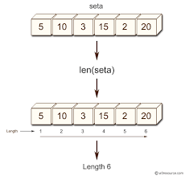
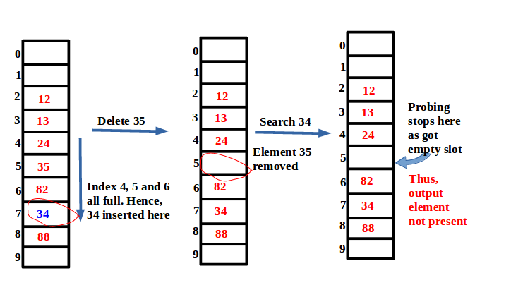
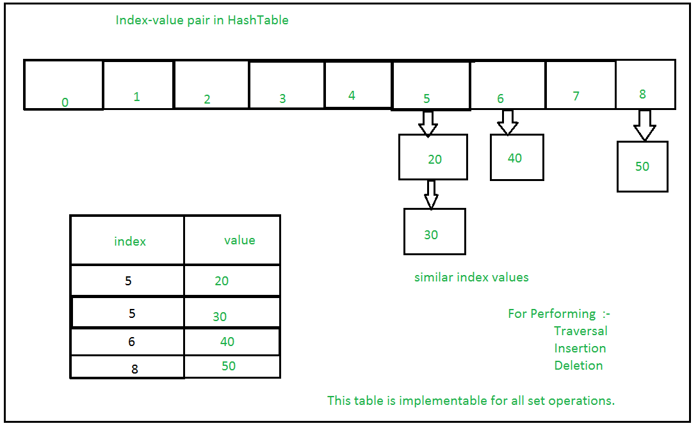

# Welcome to Sets!!
What is a set? An informal example of a set is your backpack. Why your backpack? Because in your backpack do you have the mulitiple copies of the same textbook? No you pry don't because that would be heavy and not necessary. A stack removes duplicate date for us and everything in it is unique. That is why a backpack is such a good example, you only have one type of each textbook, one calculator, and on and on. Everything in your bag is typically unique and will be that way as your go on.  The formal definition is that a set is a data type that holds only unique values in a no particular order.

***Diagram:***



## **Open addressing**
What is open addressing? This is when we try to perform a hash operation but there is no available space so we have to move to the next one. An example of this is found when Joseph was trying to find an inn where Christ could be born. Each time he asked the inn keeper kept telling him to move on until they found an open space in a manger. This is a little extreme but that is exactly what our code is doing and is one way it deals with conflicts if there is already a number occupying the space. This can lead to greater conflicts because as the set grows so does the amount of conflicts. The more you move over the more likely there will be no space which will drastically slow our program down. 

**Diagram for Open Adressing:**




## **Chaining**
The next choice is called Chaining. This is when we make a list inside of a list. This is the same as saying that we have list at index one and can then access it by iterating to the index the list is at. So now we can imagine an emergency room. There is not just one person in that space but a whole list of people. As a new person checks in they are told to have a seat in a particular section and then they called up by their name. This is a good example of chaining because multiple people can occupy one index or room. 

**Diagram for Chaining:**



# Big-O Notation Table
| Common Set Operation  |  Description |  Python Code |  BIG O |  
|-------------------------|--------------|--------------|--------|
| add(value)             | Adds value to the set  | set.add(value)  | O(1)  |  |
| remove(value)  | Removes and returns value from the set.  | set.remove(value)  | O(1)  |   |
| member(value)  | Sees if value is in set.  |  if value in set: | O(1)  |   |
| size()  | Returns number of items in set  | length = len(set)  |  O(1) |   |

## **Walk Through Problem**
We will be looking at a problem that involves finding the difference between two sets. If given in set1: {1, 2, 3, 4, 5} and in set2: {4, 5, 6, 7, 8} then the difference in set1 will output {1, 2, 3} and in set2: {6, 7, 8}. Download [Walk through](walkthrough_set.py)

1. Write an equation to find the difference between set1 and set2.
    * For this part we will implement the code:
        ```python
        print('difference of set1 to set2 is: ')
        set1_difference = set1 - set2
        print(set1_difference)
        ```
    This will allow us to get the numbers before 4 and 5 which is shared by both sets. We then will print that out to the screen.

2. Write an equation to find the difference between set2 and set1.
    
    * For this part we will implement the code:
        ```python
        print('difference of set2 to set1 is: ')
        set2_difference = set2 - set1
        print(set2_difference)
        ```
        This will allow us to get the numbers after 4 and 5 which is shared by both sets. We then will print that out to the screen.

After solving this problem we will be doing a problem where we will practice unions and finding where the intersect using the same problem as above.

## **Practice Problem**
In the above problem we see how to do the first part of a union and an intersection. In this part of this tutorial you will be figuring out how to make a set that combines the two sets at the shared values. Then you will make another set that holds those shared values only. You are tasked to find the duplicate items and will be told to do better about selling your inventory.

Download [set file](set_practice.py)

1. Create a set that combines the two sets on the shared values. Then print to the screen.
2. Create a set that stores the shared values only. Then print to the screen.

After you have solved this on your own please review my [Solution](set_solution.py).