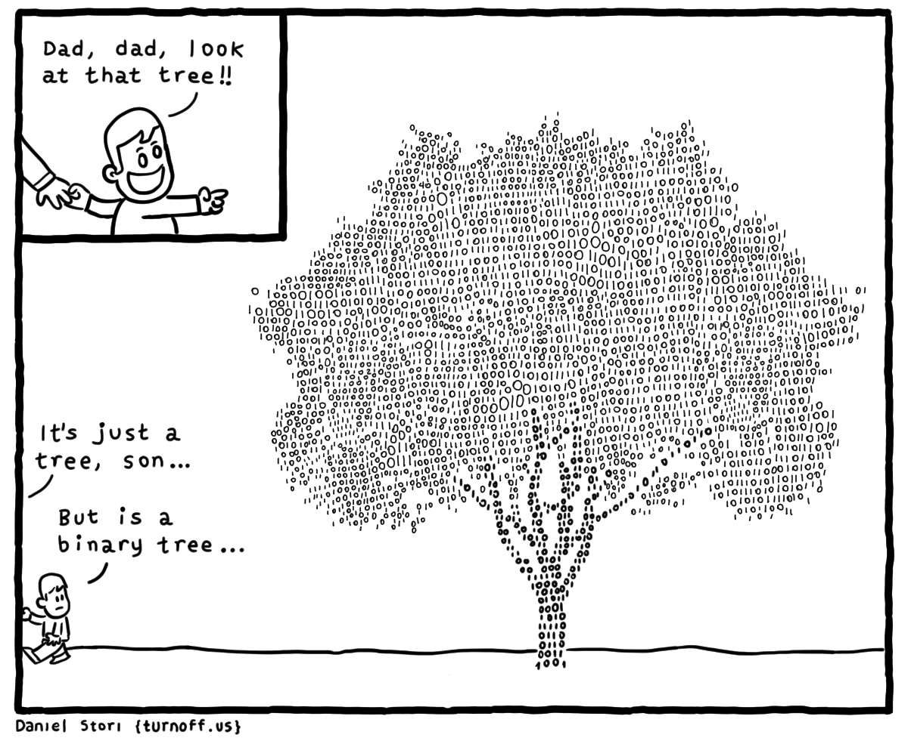
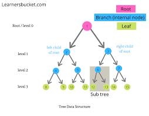
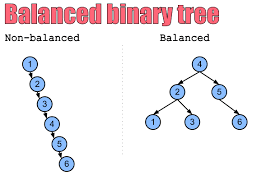

# Welcome to Trees!!


## **Binary Trees**
What is a binary tree? This is a data structure that links no more than two nodes. This is done from one node(The parent node) to two other nodes (child nodes). Knowing the definition of a Binary Tree allows us to now talk about a BST (Binary Search Tree). A BST is more of a rule of how to insert data into a tree. The rule is that you have a starting value as the parent and then ever other node that is wanting to be put in is then called a sub tree. How are these derived? Well you compare the values to one another and if the value being inserted is less than the parent then it goes to the left, if it is greater than it then it goes to the right of the tree. 

**Diagram:**



## **Balanced Binary Trees**
A balanced BST is a tree can be described by the difference of the heights of the of each subtree. This is only done if the difference isn't drastically different. This means that any subtree is relatively the same size as the other subtrees. Since this is such an important concept, there have been many algorithms that have been written to check if the tree is balanced or not. The two that are noteable are "Red Black Trees" and "AVL".

**Diagram:**



## **Traverse/Search a Binary Tree**

Before we can traverse a Binary tree we need to know how to search through a Binary tree. To be able to do this we need to search from the root the left and the right side to see if the data exists. You will do this through if statements where you will check to see if the data is greater than or less than the parent node. This will tell you if what side it is on. This will also require Recursion. 

Now that we know the concept on searching a binary tree, now we can talk about traversing it. We do this when we want to display the data in the tree. What would our base case be? Well that would be if the tree is empty, that is our base. Knowing this we can then do recursion and if statements to grab all the data from the tree and display it. Both of these concepts will be used in the two problems below and you will know how to do it by the second problem. 

## **Big-O Notation Table**
| Common Set Operation  |  Description |  BIG O |  |
|-------------------------|--------------|--------------|--------|
| insert(value)             | insert value into tree  | O(log n)  |  |
| remove(value)  | Removes value from the tree  |  O(log n)  |   |
| contains(value)  | Sees if value is in tree.  | O(log n)  |   |
| traverse_forward()  | visits all data values from smallest to largest  | O(n) |   |
| travers_backward             | visits all data values from largest to smallest  | O(n)  |  |
| height(node)             | Determines height of a node  | O(n)  |  |
| size()             |Reurn size of the BST  | O(1)  |  |
| empty()             | Returns true if the Node is empty | O(1)  |  |

## **Walkthrough Problem**
For this problem we are going to practice searching through a BST. 

Go to this file: [BST_walkthrough.py](BST_walkthrough.py)

This is the first part of the code we will work on:
```python
 mid_val = len(nums)//2
    node = TreeNode(nums[mid_val])
    node.left = sorted_array_to_bst(nums[:mid_val])
    node.right = sorted_array_to_bst(nums[mid_val+1:])
```
Before I said that you can right the if statements to do this. You can but this is less code and still works. If you want to see how to do this with if statements I have provided already written code on how to do it that way. I would look through this to better understand how to remove a node in the final problem.

[09-prove_trees.py](09-prove_trees.py)

## **Practice Problem: Remove node from the tree**
In this problem you will be removing a nod from the tree. Go to this file: [BST_delete_practice.py](BST_delete_practice.py)

Fill in the delete_node function. Use the previous file to help you think about how to do this problem. 

Here is my [solution](BST_delete_solution.py)